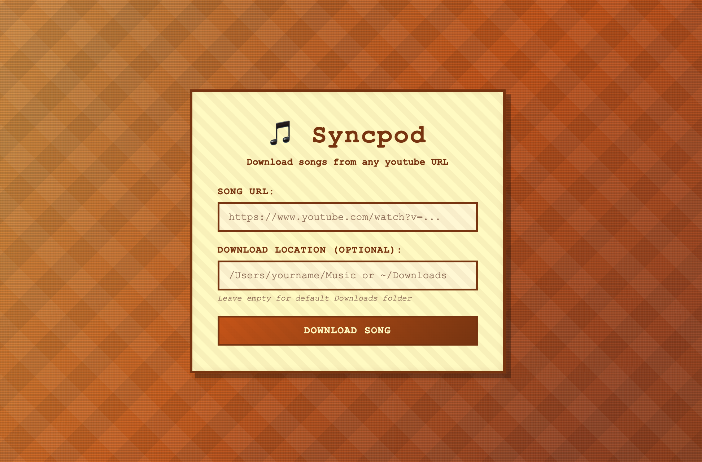

# Syncpod

Syncpod is a YouTube audio downloader that extracts audio from any YouTube video or playlist and saves it as a high-quality MP3. It's built around two modes: a **web interface** powered by Flask, and a **terminal CLI** for quick command-line use.

Both modes use the same core download engine under the hood (`yt-dlp` + `ffmpeg`), so you get the same 192kbps MP3 output either way.

---

## Web UI



---

## How it works

Syncpod accepts a YouTube URL, downloads the best available audio stream, and converts it to MP3 using ffmpeg. Files are saved to `~/Desktop/IPOD_SONGS` by default, or to any path you specify.

---

## Two Modes

### Mode 1 — Web Interface (Flask)

Start Syncpod as a local web server. A simple browser UI lets you paste a URL and kick off a download with a button click. Good for one-off downloads when you don't want to type in a terminal.

**Start the server:**
```bash
syncpod --server
```

Or just run it with no arguments:
```bash
syncpod
```

Then open your browser to:
```
http://localhost:5000
```

Paste a YouTube URL into the input field, optionally set a custom save path, and hit Download. The page shows success or error feedback when the download completes.

---

### Mode 2 — Terminal (CLI)

Pass a YouTube URL directly as an argument. Syncpod downloads and converts in the terminal, then exits. Good for scripting, batch work, or when you just want something fast without opening a browser.

**Download a single video to the default folder (`~/Desktop/IPOD_SONGS`):**
```bash
syncpod "https://www.youtube.com/watch?v=9ZYjf3TC2LU"
```

**Download to a custom folder:**
```bash
syncpod "https://www.youtube.com/watch?v=9ZYjf3TC2LU" --path ~/Music
syncpod "https://www.youtube.com/watch?v=9ZYjf3TC2LU" -p ~/Music
```

**Download a full playlist:**
```bash
syncpod "https://www.youtube.com/playlist?list=RDEs4NrOnoNb4"
```

**Show all options:**
```bash
syncpod --help
```

---

## Setup

### 1. Install Python 3.9+

Check if you already have it:
```bash
python3 --version
```

If not, download it from [python.org](https://www.python.org/downloads/) or via Homebrew:
```bash
brew install python
```

### 2. Install uv (package manager)

`uv` is used to manage the virtual environment and dependencies:
```bash
curl -LsSf https://astral.sh/uv/install.sh | sh
```

### 3. Install ffmpeg

ffmpeg handles the audio conversion to MP3. Install it via Homebrew:
```bash
brew install ffmpeg
```

Verify it's installed:
```bash
ffmpeg -version
```

### 4. Install Python dependencies

From the project directory, run:
```bash
cd /Users/pratikaher/Syncpod
uv sync
```

This creates a `.venv` folder and installs `yt-dlp` and `Flask` into it.

### 5. Make the `syncpod` command available globally

The `bin/syncpod` script is the entry point. Add it to your PATH so you can call `syncpod` from anywhere:
```bash
# Add this line to your ~/.zshrc or ~/.bashrc
export PATH="/Users/pratikaher/Syncpod/bin:$PATH"
```

Then reload your shell:
```bash
source ~/.zshrc
```

Verify it works:
```bash
syncpod --help
```

---

## Requirements

- Python 3.9+
- ffmpeg (audio conversion)
- uv (dependency management)
- yt-dlp (YouTube extraction, installed via `uv sync`)
- Flask (web server mode, installed via `uv sync`)
